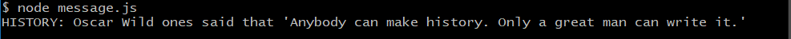

# Message Project for Codecademy

## Table of Contents
* [Introduction](#introduction)
* [Technologies](#technologies)
* [To Run](#to-run)
* [Example](#example) 
* [Project Status](#status)

## Introduction
The project's primary goal is to write a simple program in JavaScript that generates a new message every time you run it locally to practice what I learned about **Git**, **Github**, **Markdown**, **JavaScript**, and **Nodejs** from its path *Full-Stack Software Engineer*.

## Technologies 

* JavaScript - ECMAScript 2016
* Node.js - v14.18.0
* Bash
* Git
* GitHub

## To run

```bash
node message.js
```

## Example

Run program: 
```
node message.js
```
Your will get something like:



## Status

Completed